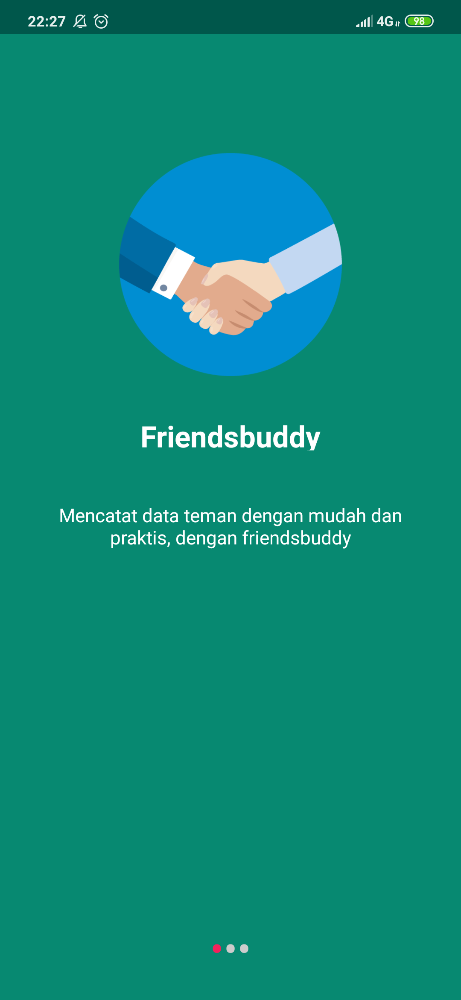
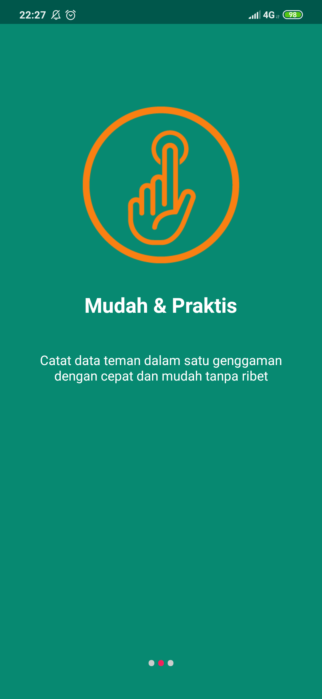
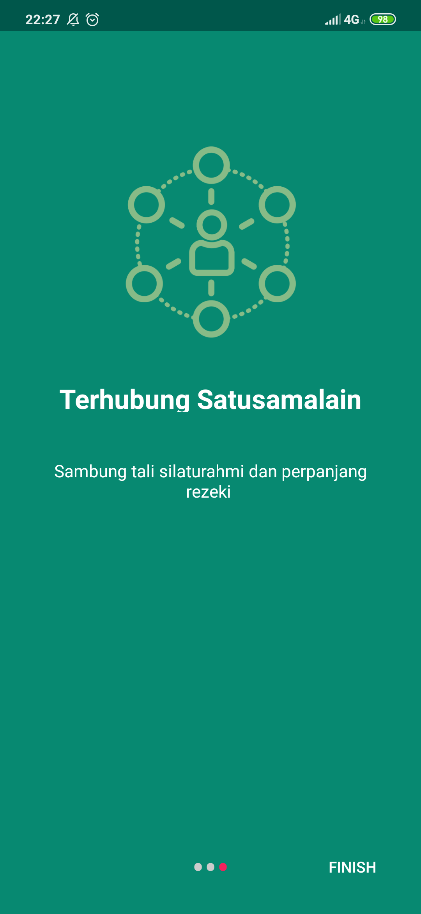
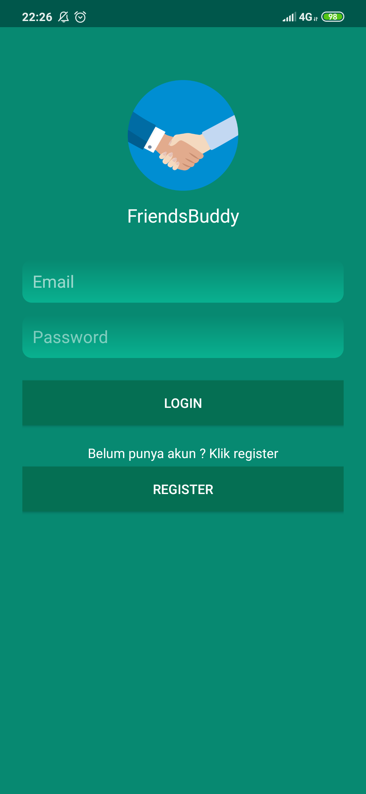
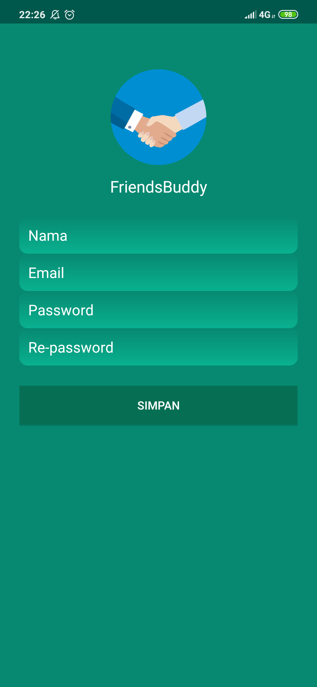

# UAS-AKB-IF7-10116296
Tugas ini ditujukan untuk memenuhi "Tugas Pengganti UAS AKB"- 2019

<b>Detail aplikasi "FriendsBuddy" : </b> 
<li> Splash Screen 
<h3 align="center">
  
</h3>
<li>Buat informasi tentang aplikasi dengan menggunakan ViewPager
 <h3 align="center">
  
  
  
  </h3>
<li>Login Activity yang meliputi proses Register dan Login 
  <h3 align="center">
  
  
  </h3>
<li>Menu (menggunakan Bottom Navigation/Navigation Drawer) 
 a. Profil (Foto Diri, NIM, Nama, Kelas, Deskripsi Diri) 
 b. Kontak (Telepon, Email, Social Media Pribadi) 
 c. Daftar Teman Menampilkan list teman (NIM, Nama, Kelas, Telepon, Email, Social Media Pribadi) CRUD
 d. Sign Out 
 
 Menggunakan database [Realm](https://realm.io) untuk:
 <li> Penyimpanan data teman
 <li> Session login
