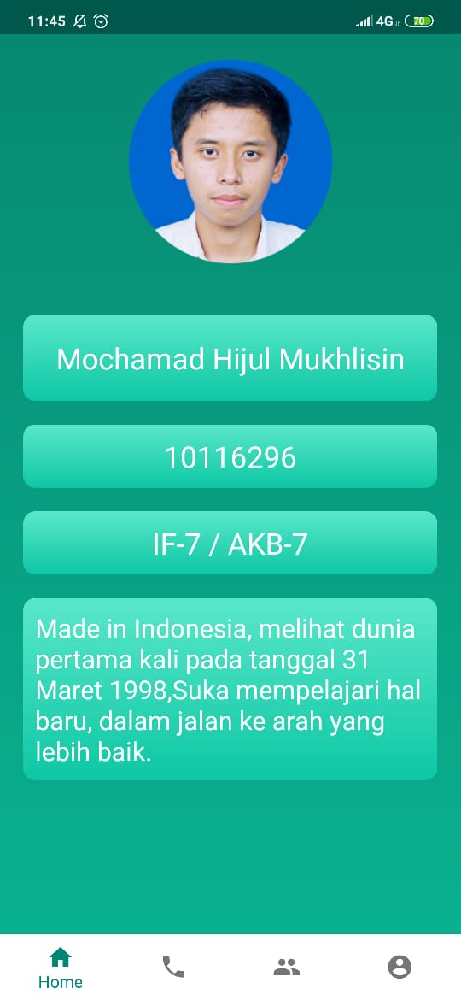
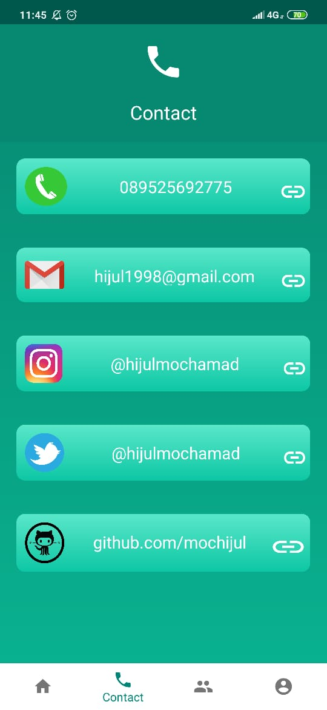
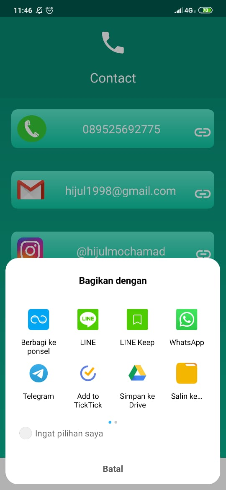
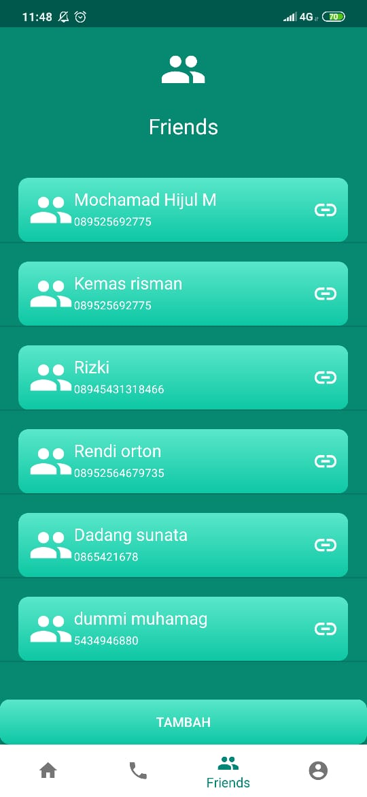
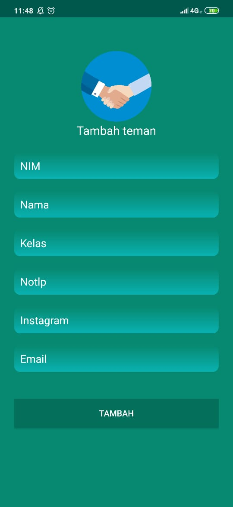
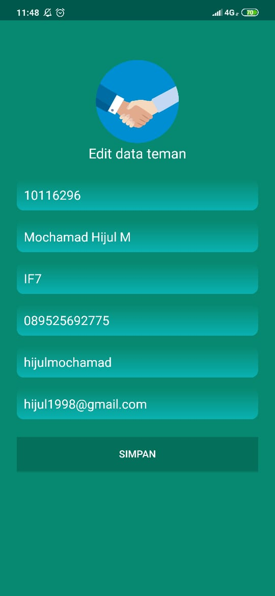
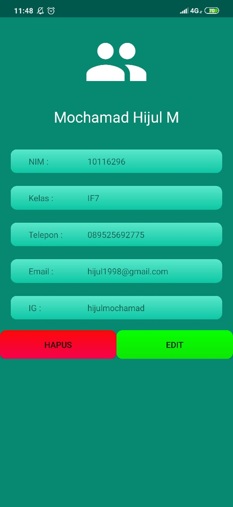
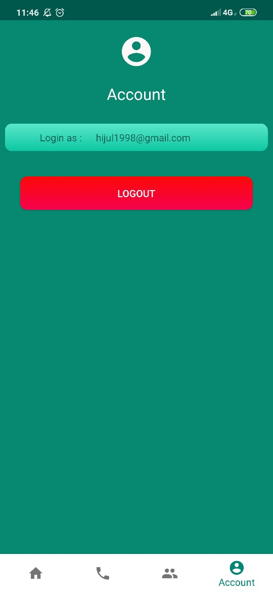

# UAS-AKB-IF7-10116296
Tugas ini ditujukan untuk memenuhi "Tugas Pengganti UAS AKB"- 2019

<b>Detail aplikasi "FriendsBuddy" : </b> 
<li> Splash Screen 
<h3 align="center">
  
</h3>
<li>Buat informasi tentang aplikasi dengan menggunakan ViewPager
 <h3 align="center">
  
  
  
  </h3>
<li>Login Activity yang meliputi proses Register dan Login 
  <h3 align="center">
  
  
  </h3>
<li>Menu (menggunakan Bottom Navigation/Navigation Drawer) 
 a. Profil (Foto Diri, NIM, Nama, Kelas, Deskripsi Diri)
  <h3 align="center">
  
  </h3>
 b. Kontak (Telepon, Email, Social Media Pribadi) ( + Implicit intent)
  <h3 align="center">
  
  
  </h3>
 c. Daftar Teman Menampilkan list teman (NIM, Nama, Kelas, Telepon, Email, Social Media Pribadi) CRUD
  <h3 align="center">
  
  
    
    
  </h3>
 d. Sign Out 
 <h3 align="center">
  
  </h3>
  

 Menggunakan database [Realm](https://realm.io) untuk:
 <li> Penyimpanan data teman
 <li> Session login
